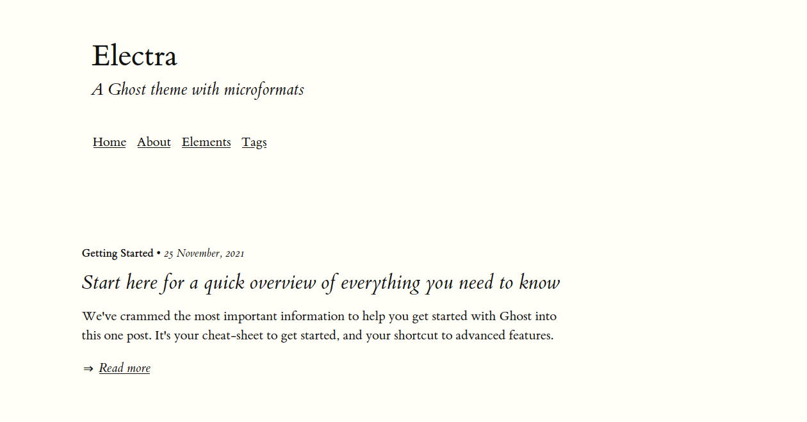

# Electra

A minimal Ghost theme with microformats

**Current ver:** 1.0.0

[Demo](https://electra-theme.netlify.app)

## Features

This theme was written with text-heavy, one-author blogs in mind. It's not supposed to be intrusive to the reader, so it doesn't have any sections with a subscribe widget. If you have a newsletter on your Ghost blog, you can add a link to the subscribe page on your header or footer.

It features

- Microformats on post feed and individual post pages
- IndieAuth
- h-card
- Dropdown menu
- Margin and side notes

You can run a static website with this theme using [ghost-static-site-generator](https://github.com/Fried-Chicken/ghost-static-site-generator) or [gui](https://github.com/huangyuzhang/gui/). Note that paid memberships are not possible this way, and although free newsletter are possible, they are not recommended.

## Installation

Download this repo as zip and upload it to your site from your Ghost dashboard.

## Settings

You will have to edit the following files. All of them are optional, but in order to remove them, you have to edit either `default.hbs` (for IndieAuth and h-card) or `main-header.hbs` (for dropdown menu)

### Dropdown menu

Add your links in [dropdown menu](partials/edit/dropdown.hbs). To update it, you will have to download your theme, unzip it, change the file, zip it and upload it back in your Ghost installation. It's not practical, and I will soon write a script to make this easier.

The menu title is set in `{{t "Menu"}}`, translated on each locale. If you want a different word, change by replacing `"Menu"` (second word, after `:`) on your locale .json.

To remove the menu altogether, delete the commented line on [main-header.hbs](main-header.hbs)

### Indieauth and h-card

Edit the following files on **partials/edit**:

- [h-card](partials/edit/hcard.hbs): add your data. You can remove any line you don't want to fill.
- [indieauth](partials/edit/indieauth.hbs): add your accounts and e-mail address.

h-card is hidden by default. It's not styled.

To remove these sections, delete the commented lines on [default.hbs](default.hbs). IndieAuth can be found on `<header>` and h-card is at the bottom of the page.

### Comments

Add your embed code on [comment.hbs](partials/comment.hbs)

### Margin and side notes

See [notes](snippets/notes.md)

## l10n

- [x] en
- [x] pt-BR

## To do
- [ ] Write script to automate edits on dropdown menu
- [ ] Fix styling for form elements
- [ ] \(Optional) Fix dark mode
- [ ] \(Optional) Write doc on how to have a newsletter on a static website

## Credits

- Built on [curiostry/undefined-ghost-theme](https://github.com/curiostry/undefined-ghost-theme)
- CSS from [edwardtufte/tufte-css](https://github.com/edwardtufte/tufte-css)
